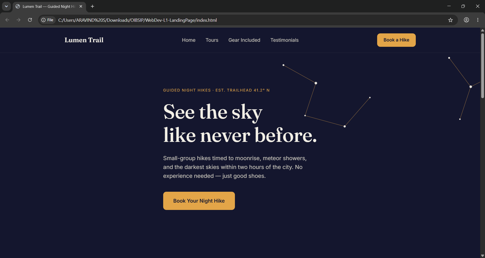
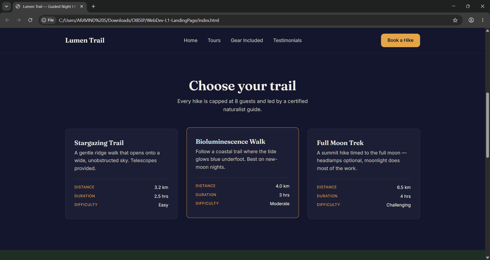
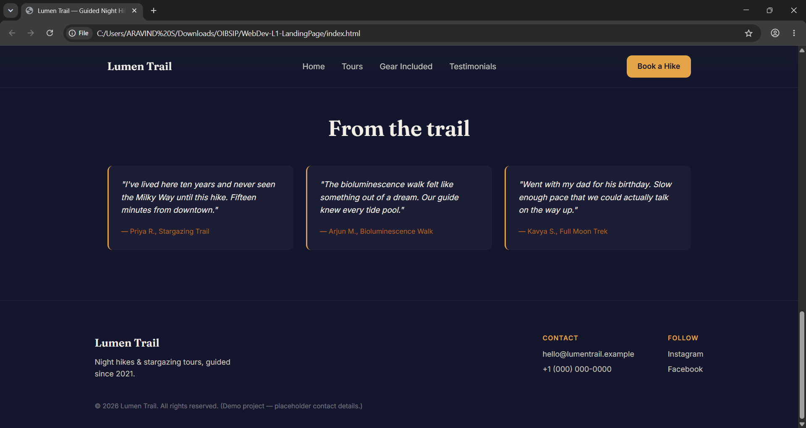

# 🌌 Lumen Trail — Landing Page

**Oasis Infobyte SIP Internship**  
**Track:** Web Development & Designing  
**Level 1 — Task 1: Landing Page**

A responsive landing page for **Lumen Trail**, a fictional guided night-hiking and stargazing tour company. Built using only HTML5 and CSS3 with a focus on visual hierarchy, responsive design, accessibility, and clean UI principles.

---

## 🚀 Live Demo

> Add your GitHub Pages link here after deployment

**Live Website:**  
[View Project](https://aravindashen.github.io/OIBSIP/)

---

## 📸 Screenshots

### Hero Section



### Tours Section



### Testimonials & Gear Included



---

## 🎯 Project Objective

The goal of this project was to design and develop a visually appealing, fully responsive landing page that demonstrates core front-end development skills using HTML and CSS.

Instead of building a generic template, the project is centered around a fictional brand called **Lumen Trail**, allowing every section to contain meaningful and realistic content.

---

## 🎨 Design Approach

### Color Palette

| Color | Purpose |
|---------|---------|
| Ink Indigo `#14162E` | Primary background |
| Ember Gold `#E3A548` | Accent color & CTA buttons |
| Deep Moss `#1F2E24` | Alternate section backgrounds |

The palette was selected to evoke the atmosphere of night skies, campfires, and outdoor exploration.

### Typography

- **Fraunces** — Headings
- **Inter** — Body Text

This pairing balances personality and readability while maintaining a modern aesthetic.

### Signature Visual Element

A custom SVG constellation graphic with a subtle twinkle animation was created to reinforce the stargazing theme and provide a unique visual identity.

---

## ✨ Features

- Sticky Navigation Bar
- Responsive Hero Section
- Tour Information Cards
- Gear Included Section
- Customer Testimonials
- Call-to-Action Buttons
- Smooth Responsive Layout
- Mobile-Friendly Design
- Custom SVG Illustration
- Accessible Keyboard Navigation

---

## ✅ Task Requirements Covered

- [x] Navigation Menu
- [x] Hero Section
- [x] Call-To-Action Button
- [x] Multiple Content Sections
- [x] Footer Section
- [x] Responsive Layout
- [x] Attractive Color Scheme
- [x] Proper Spacing & Alignment
- [x] Typography Hierarchy
- [x] Mobile Compatibility

---

## 🛠️ Tech Stack

### Front-End

- HTML5
- CSS3

### Fonts

- Google Fonts
  - Fraunces
  - Inter

### Layout Techniques

- CSS Grid
- Flexbox
- CSS Custom Properties
- Media Queries

---

## 📂 Project Structure

```text
WebDev-L1-LandingPage/
│
├── index.html
├── README.md
│
├── css/
│   └── style.css
│
└── screenshots/
    ├── hero-section.png
    ├── tours-section.png
    └── testimonials-section.png
```

---

## ♿ Accessibility Features

- Semantic HTML5 elements
- Keyboard-focus support
- Visible focus indicators
- Responsive typography
- Proper heading hierarchy
- Reduced motion support using:

```css
prefers-reduced-motion
```

---

## 📚 Learning Outcomes

Through this project, I strengthened my understanding of:

- Semantic HTML structure
- Responsive web design
- CSS Grid & Flexbox
- UI/UX design principles
- Accessibility best practices
- Project documentation using Markdown
- Git & GitHub workflow

---

## 👨‍💻 Author

**Aravind**

Oasis Infobyte Internship Program

GitHub: https://github.com/aravindashen
