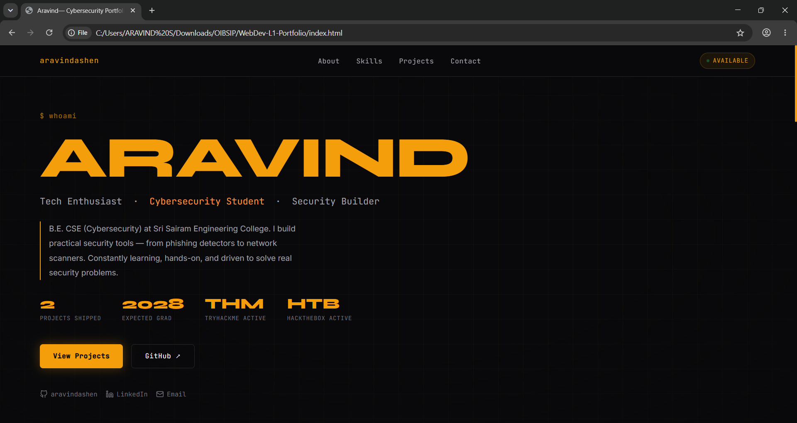
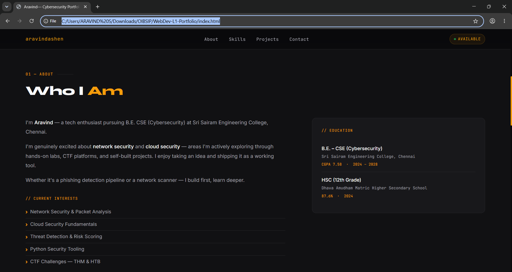
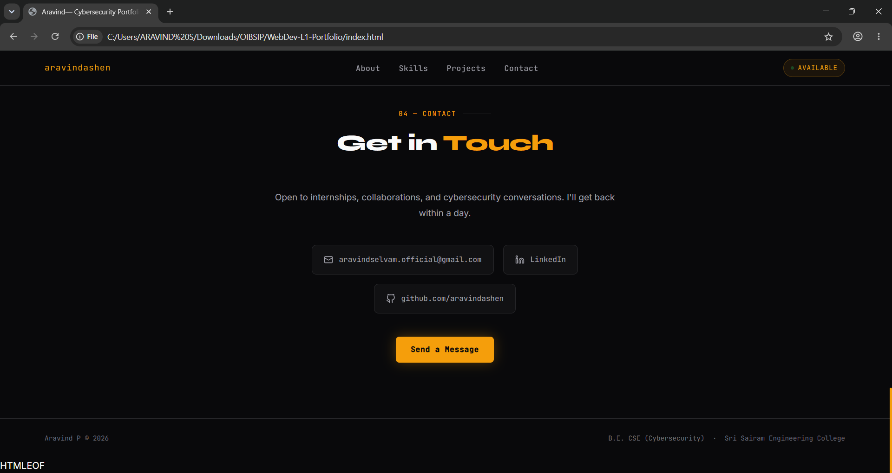

# Personal Portfolio Website

## Oasis Infobyte Internship – Web Development & Designing

### Level 1 – Task 2

A modern, responsive cybersecurity-focused portfolio website designed to showcase my technical skills, projects, education, and professional profile. The portfolio highlights my passion for cybersecurity, hands-on security projects, and continuous learning journey in network and cloud security.

---

## Live Demo

Add your deployed portfolio link here after deployment.

---

## Features

- Responsive design for desktop, tablet, and mobile devices
- Professional cybersecurity-themed UI
- Smooth scrolling navigation
- Animated hero section
- About Me section
- Skills showcase
- Project portfolio section
- Contact section with social links
- Interactive hover effects and animations
- Modern dark theme design

---

## Sections Included

### Hero Section
- Introduction
- Professional role
- Quick statistics
- Social media links
- Call-to-action buttons

### About Me
- Educational background
- Career goals
- Areas of interest
- Current learning focus

### Skills
- Programming Languages
- Cybersecurity Domains
- Tools & Technologies
- Practice Platforms

### Projects
- AI-Powered Phishing & Threat Detection System
- Multi-Threaded Network Port Scanner
- Lumen Trail Landing Page

### Contact
- Email
- LinkedIn
- GitHub

---

## Technologies Used

- HTML5
- CSS3
- JavaScript
- Google Fonts
- Git
- GitHub

---

## Screenshots

### Home Section



### About Section



### Contact Section



---

## Learning Outcomes

Through this project, I strengthened my understanding of:

- Responsive Web Design
- HTML5 Semantic Elements
- CSS Flexbox & Grid
- UI/UX Design Principles
- JavaScript DOM Manipulation
- Git & GitHub Workflow
- Project Documentation

---

## Project Structure

```text
WebDev-L1-Portfolio/
├── index.html
├── README.md
└── screenshots/
    ├── home.png
    ├── about.png
    └── contact.png
```

---

## Author

**Aravind P**

Aspiring Cybersecurity Engineer

GitHub: https://github.com/aravindashen

LinkedIn: https://www.linkedin.com/in/aravind-p-a65228340

---

## Internship

Submitted as part of the Oasis Infobyte Web Development & Designing Internship Program.