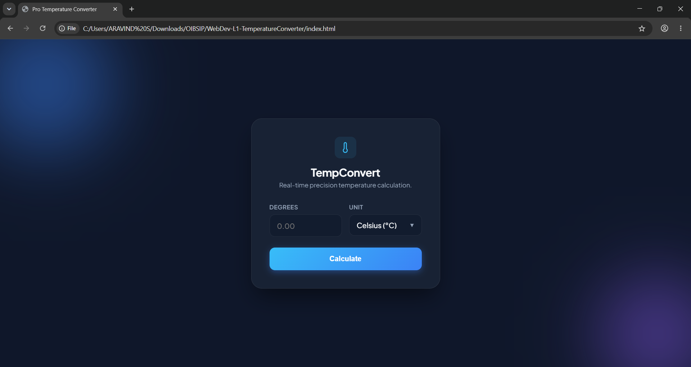
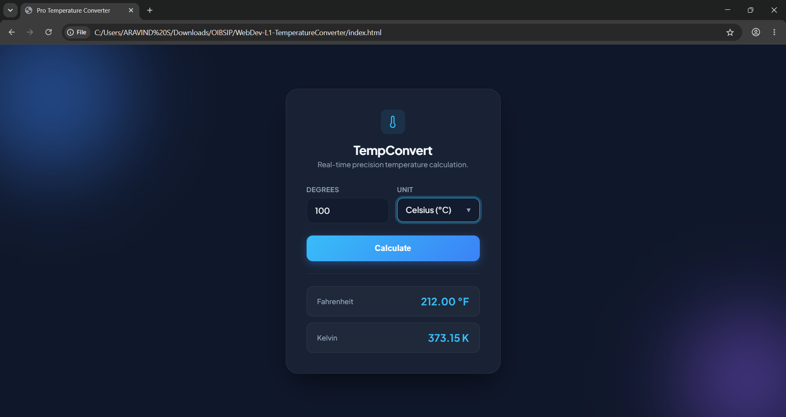

# 🌡️ Temperature Converter

## Oasis Infobyte Internship – Web Development & Designing

**Level 1 – Task 3**

A responsive temperature conversion web application that allows users to convert values between **Celsius**, **Fahrenheit**, and **Kelvin** instantly. The project focuses on JavaScript-based calculations, user input validation, and a clean user interface.

---

## 🚀 Live Demo

**Live Website:**  
https://aravindashen.github.io/OIBSIP/WebDev-L1-TemperatureConverter/

---

## 📖 Project Overview

The Temperature Converter enables users to:

- Convert Celsius to Fahrenheit and Kelvin
- Convert Fahrenheit to Celsius and Kelvin
- Convert Kelvin to Celsius and Fahrenheit
- Get instant results without page reloads
- Experience a responsive layout across devices

---

## 🛠️ Technologies Used

- HTML5
- CSS3
- JavaScript (ES6)

---

## ✨ Features

- Responsive user interface
- Real-time temperature conversion
- Input validation
- Clean and intuitive design
- Mobile-friendly layout

---

## 📸 Screenshots

### Home Interface



### Temperature Conversion Example



---

## 📂 Project Structure

```text
WebDev-L1-TemperatureConverter
│
├── index.html
├── style.css
├── script.js
├── screenshots
│   ├── home.png
│   └── temperature.png
└── README.md
```

---

## 🎯 Learning Outcomes

Through this project, I gained practical experience in:

- DOM Manipulation
- JavaScript Functions
- Event Handling
- Form Validation
- Responsive Web Design
- Project Deployment using GitHub Pages

---

## 👨‍💻 Author

**Aravind P**

GitHub: https://github.com/aravindashen

---

## 🔗 Repository

https://github.com/aravindashen/OIBSIP